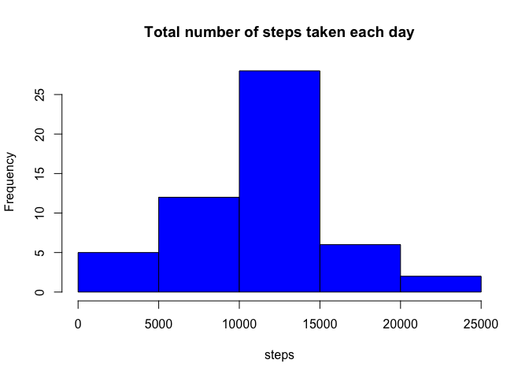
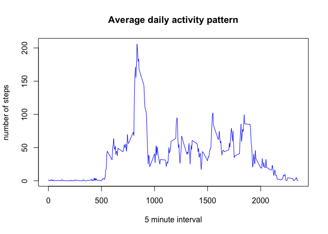
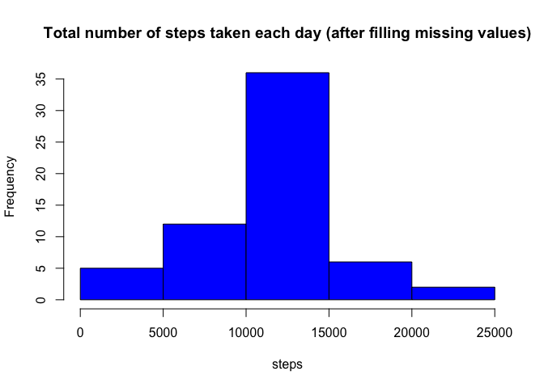
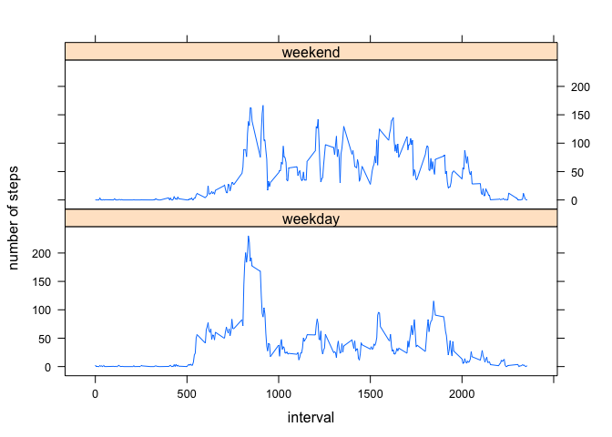

# Reproducible Research: Peer Assessment 1


## Loading and preprocessing the data

* unzip and read the activity data
* convert the "date" field to POSIX date type
* keep the data subset without missing values in **stepsReported** variable


```r
data <- read.csv(unz("activity.zip", 'activity.csv'))
data$date <- as.POSIXct(data$date)
stepsReported <- data[!is.na(data$steps),]
```

## What is mean total number of steps taken per day?

* calculate the total number of steps per day
* plot a histogram of steps per day 


```r
stepsByDate <- aggregate(stepsReported$steps, list(date = stepsReported$date), sum)
hist(stepsByDate$x, 
     col = "blue",
     main = "Total number of steps taken each day",
     xlab = "steps")
```

 

* calculate mean of total steps per day

```r
mean(stepsByDate$x)
```

```
## [1] 10766.19
```

* calculate median of total steps per day

```r
median(stepsByDate$x)
```

```
## [1] 10765
```


## What is the average daily activity pattern?

* calculate average number of steps per 5-min interval over all days
* plot average number of steps per interval 


```r
avgStepsByInterval <- aggregate(stepsReported$steps, list(interval = stepsReported$interval), FUN = mean)
plot(avgStepsByInterval$interval, avgStepsByInterval$x, 
     type = "l", col='blue', 
     main = "Average daily activity pattern", 
     xlab = "5 minute interval", 
     ylab = "number of steps")
```

 

* find the interval containing the max number of steps

```r
idx <- which.max(avgStepsByInterval$x)
avgStepsByInterval$interval[idx]
```

```
## [1] 835
```


## Imputing missing values

* calculate total number of missing values


```r
missing <- which(is.na(data$steps))
length(missing)
```

```
## [1] 2304
```

* create a new dataset 
* fill missing values by using average for the same 5 minute interval


```r
filledData <- data
for (i in  missing) {
    interval <- filledData$interval[i]
    filledData$steps[i] <- avgStepsByInterval[avgStepsByInterval$interval == interval,]$x
}
```

* calculate the total number of steps per day after imputting missing data 
* plot a histogram of steps per day 


```r
newStepsByDate <- aggregate(filledData$steps, list(date = filledData$date), sum)
hist(newStepsByDate$x, 
     col = "blue",
     main = "Total number of steps taken each day (after filling missing values)",
     xlab = "steps")
```

 

* calculate mean of total steps per day

```r
mean(newStepsByDate$x)
```

```
## [1] 10766.19
```

* calculate median of total steps per day

```r
median(newStepsByDate$x)
```

```
## [1] 10766.19
```

**Conclusion: ** Imputing missing values does not change the estimates of the total daily number of steps

## Are there differences in activity patterns between weekdays and weekends?

* add a new factor variable to the filled dataset with the week day of the date
* change the factor variable so that it has only two levels - "weekday" and "weekend"


```r
filledData$weekday <- factor(weekdays(filledData$date), 
                             levels = c("Monday", "Tuesday", "Wednesday", "Thursday", "Friday", "Saturday", "Sunday"))
levels(filledData$weekday) <- c(rep("weekday", 5), rep("weekend", 2))
```

* calculate average number of steps per interval over all the weekdays and weekends
* plot the result of calculation as a panel graph


```r
library('lattice')
avgStepsPerWeekday <- aggregate(filledData$steps, list(interval = filledData$interval, weekday = filledData$weekday), FUN = mean)
xyplot(x~interval|weekday, avgStepsPerWeekday, type="l", ylab = "number of steps", layout = c(1,2))
```

 
